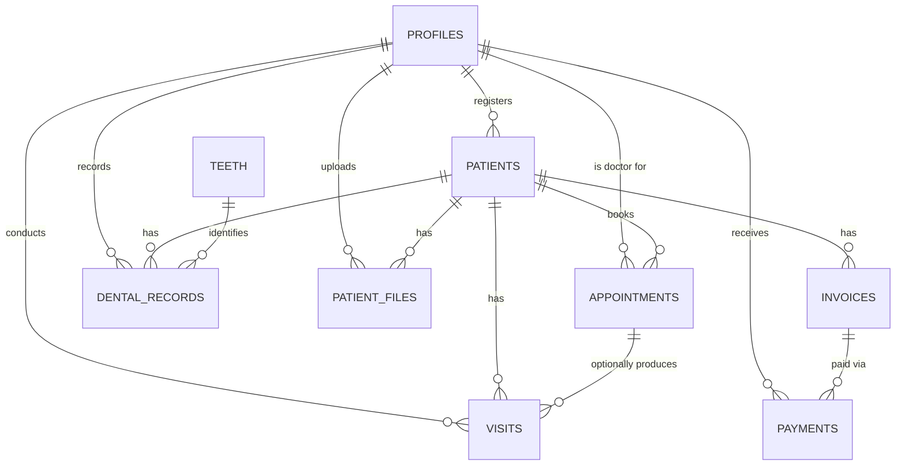

# Dental Clinic — Entity Relationship Diagram

## Notes

- The schema is intentionally simple: patient allergies/chronic conditions
  are freetext fields on `patients` (`allergies`, `medical_notes`), not
  relational catalogs. Tooth conditions on `dental_records` are freetext
  too (`condition`), not a lookup table.
- Tooth numbering follows FDI/ISO-3950 (e.g. `36` = lower left first
  molar). `teeth.fdi_number` is the code; `teeth.dentition_type` is
  `primary` or `permanent`.
- `dental_records` is append-only history — nothing is overwritten, so a
  full audit trail of a tooth's condition over time is always available.
- `visits` is a single freeform clinical record per encounter (diagnosis +
  treatment + notes), optionally linked back to the `appointments` row it
  came from (`appointment_id`, nullable — deleting an appointment doesn't
  delete visit history).
- `patient_files` stores a `file_url` directly (X-rays/photos/PDFs hosted
  wherever the app puts them) plus a `file_type` (`xray`/`image`/`pdf`).
- `invoices.paid_amount` and `invoices.status` are denormalized columns
  kept in sync by a database trigger (`sync_invoice_paid_amount`,
  `supabase/migrations/20260712000022_billing.sql`) that recomputes them
  whenever a `payments` row is inserted, updated, or deleted — there's no
  separate invoice-line-item or installment table.
- No reporting views exist yet in this schema; reporting will need to be
  designed fresh against these tables when that phase comes up.
